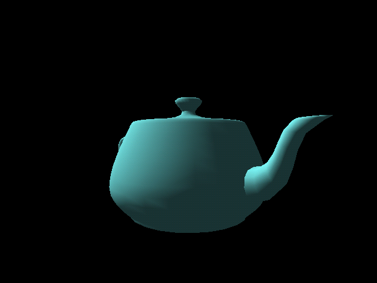
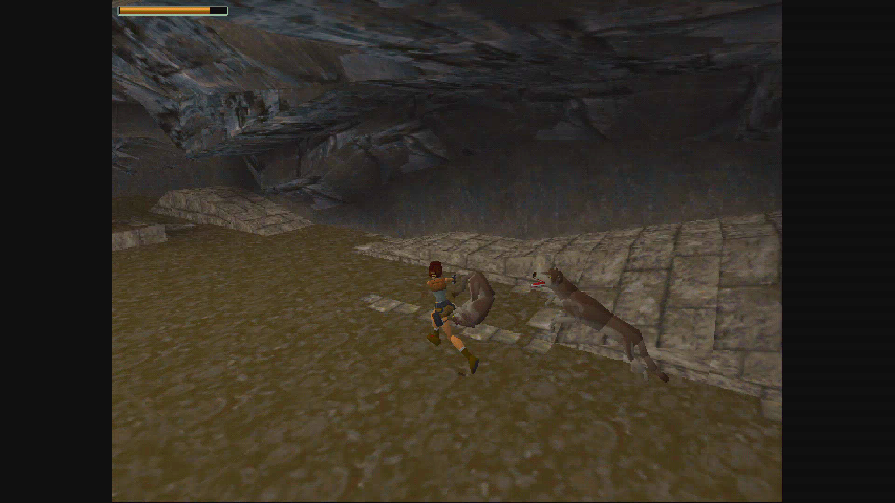
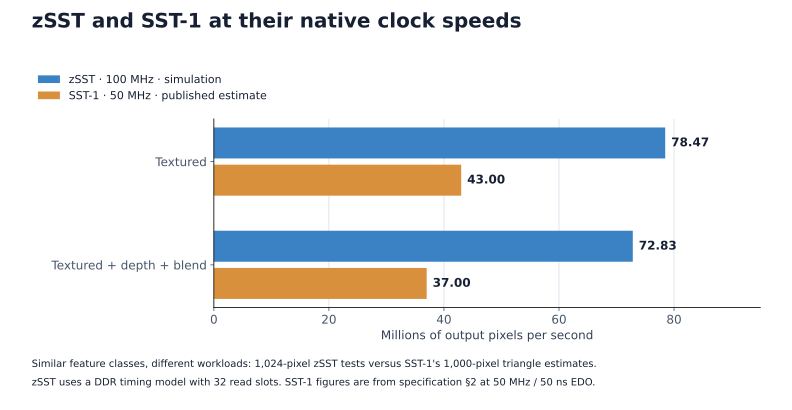

# zSST

zSST is a portable SystemVerilog implementation of the 3dfx Voodoo Graphics
(SST-1) programming model. It runs original Glide software through the
standard SST-1 register, framebuffer, and texture-memory interfaces.

Read the [zSST design write-up](https://nand2mario.github.io/posts/2026/zsst-voodoo/)
for the pixel pipeline, memory-system design, and performance results.

| Test scene: Utah teapot | Game scene: Tomb Raider |
| --- | --- |
|  |  |
| zSST simulation render. | KV260 HDMI capture; contrast and saturation enhanced for presentation. |

Most core Voodoo Graphics functionality is implemented, including fixed-point
and floating-point prepared-triangle interfaces, linear-framebuffer access,
fast fill, depth and alpha testing, chroma keying, fog, blending, dithering,
stipple, point and bilinear texture filtering, mipmapping, NCC and palette
textures, buffer swaps, gamma CLUT, and video state. zSST also provides
implementation-specific performance counters.

Hardware game testing is currently limited, with Tomb Raider being the main
validated title. Broader compatibility remains to be established. Multi-TMU
configurations, SLI, and later Voodoo generations are outside the current
scope.

The first hardware integration is
[z486 XL](https://github.com/nand2mario/z486_XL), which combines zSST with a
complete z486 PC on the Xilinx KV260. Use that repository to build or try the
full system on a KV260 board.

## Performance

In the current Xilinx XCK26 Zynq UltraScale+ MPSoC integration, the zSST
device uses 29,538 LUTs, 28,109 flip-flops, 14 RAMB36 blocks, 8 RAMB18 blocks,
and 97 DSP slices. It closes timing at 100 MHz as part of the complete z486 XL
system.



Renderer simulation with a DDR timing model, compared with published SST-1
estimates at each design's native clock. Workloads and enabled features differ;
this is an approximate fill-rate comparison, not a matched hardware benchmark
or a measure of game FPS. See the [evaluation methodology](https://nand2mario.github.io/posts/2026/zsst-voodoo/#evaluation-results).

## Tests

Verilator, a C++ compiler, and Python 3 are required. Check generated sources,
compile the complete RTL closure, and run the compact frontend smoke test with:

```sh
make test
```

## Integration

The top-level portable device is `sst1_device.sv`. It exposes host requests,
framebuffer/texture memory requests, video timing and pixels, and a versioned
performance-counter bank. The public register contract is documented in
[REGISTER_MAP.md](REGISTER_MAP.md).

## Credits

[SpinalVoodoo](https://github.com/fayalalebrun/SpinalVoodoo) provided Glide
test traces and rendered screenshots that proved invaluable as realistic
correctness references.

The SST-1 programming specification served as the primary behavioral contract
for implementing and verifying registers, rendering state, and the pixel
pipeline.

[86Box](https://86box.net/) served as an implementation reference for complex
behavior such as triangle rasterization, and as a cross-check where the
specification was ambiguous.

## License and trademarks

Original zSST source in this repository is licensed under Apache-2.0; see
[LICENSE](LICENSE). External specifications and optional test assets retain
their own licenses and are not relicensed here.

3dfx, Voodoo, and Glide are trademarks of their respective owners. This is an
independent open-source project and is not affiliated with or endorsed by
those owners.
